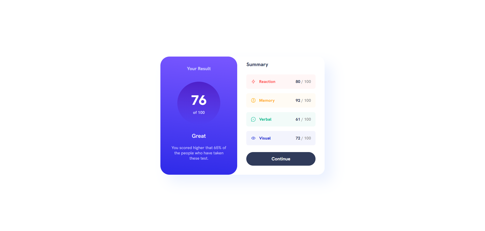

# Frontend Mentor - Results summary component solution

This is a solution to the [Results summary component challenge on Frontend Mentor](https://www.frontendmentor.io/challenges/results-summary-component-CE_K6s0maV). Frontend Mentor challenges help you improve your coding skills by building realistic projects. 

## Table of contents

- [Overview](#overview)
  - [The challenge](#the-challenge)
  - [Screenshot](#screenshot)
  - [Links](#links)
- [My process](#my-process)
  - [Built with](#built-with)
  - [What I learned](#what-i-learned)
  - [Continued development](#continued-development)
  - [Useful resources](#useful-resources)
- [Author](#author)

## Overview

### The challenge

Users should be able to:

- View the optimal layout for the interface depending on their device's screen size
- See hover and focus states for all interactive elements on the page
- **Bonus**: Use the local JSON data to dynamically populate the content

### Screenshot



### Links

- Solution URL: [GitHub Repo](https://github.com/AlexanderTejedor/Results-summary-component)
- Live Site URL: [GitHub Pages](https://alexandertejedor.github.io/Results-summary-component/)

## My process

### Built with

- Semantic HTML5 markup
- CSS custom properties
- Flexbox
- CSS Grid
- Mobile-first workflow

### What I learned

In this challenge, I liked that I was able to remember how to use gradients and shadows. It was very useful for improving frontend skills and also for creating amazing web pages.

```css
.results-container{
    background:linear-gradient(185deg, var(--light-slate-blue-background), var(--tight-royal-blue-background-));
}
.results-progress{
    background: linear-gradient(180deg, var(--violet-blue-circle), var(--persian-blue-circle));
}
.card-container{
    box-shadow: 30px 30px 50px var(--pale-blue);
}
```

### Continued development

I managed to use the JSON file to dynamically fill the elements, but I didn't want to add it because I still need more practice. In future challenges, I will continue studying enough to be able to implement them in the best way.

### Useful resources

- [Google Fonts](https://fonts.google.com/) - This helped me to use external fonts instead of local ones, so that everyone can identify the type of font I used for this challenge.

## Author

- Website - [Alexander Tejedor](https://github.com/AlexanderTejedor)
- Frontend Mentor - [@AlexanderTejedor](https://www.frontendmentor.io/profile/AlexanderTejedor)
- Twitter - [@Alexand59894016](https://x.com/Alexand59894016)